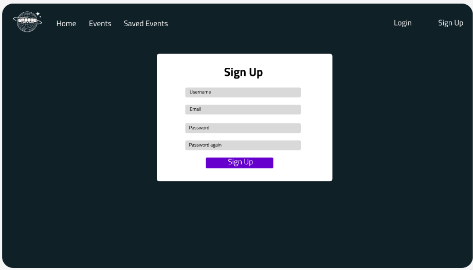
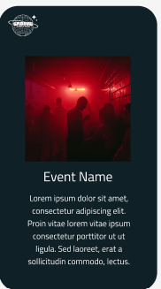
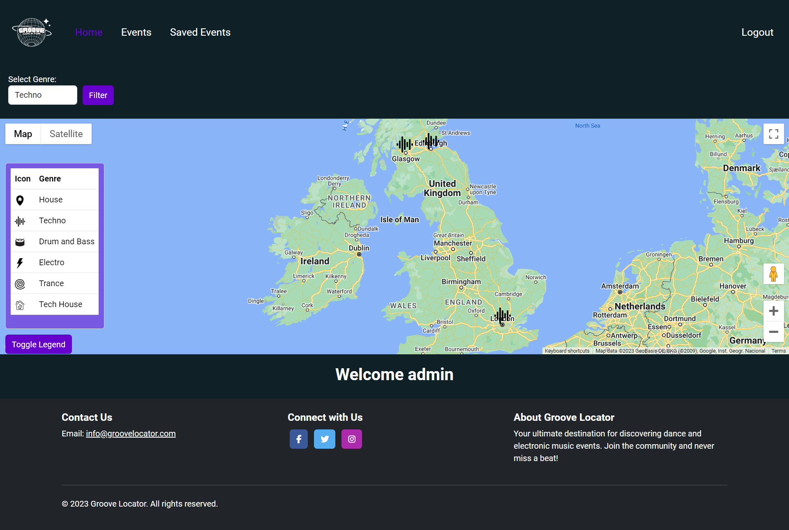

# GrooveLocator
The Green Dragon Pub Quiz is an interactive, JavaScript-based quiz game that tests users' knowledge of The Lord of The Rings universe. The site provides visual and audio feedback depending on whether the correct or incorrect answer is selected. User high scores are also recorded alongside their username, creating a fun and competitive environment.
 

## [Link to live site](https://groove-locator-1cf946ce6f56.herokuapp.com/)

## Contents

1. [User Experience](#user-experience)
   * [User Stories](#user-stories)
2. [Design](#design)
   * [Colour Scheme](#colour-scheme)
   * [Typography](#typography)
   * [Wireframes](#wireframes)
3. [Features](#features)
   * [Future Implementations](#future-implementations)
   * [Accessibility](#accessibility)
4. [Technologies](#technologies)
   * [Languages](#languages)
   * [Frameworks, Libraries and Programs](#frameworks-libraries-and-programs)
5. [Testing](#testing)
6. [Deployment](#deployment)
7. [Credits](#credits)
   * [Code](#code)
   * [Content](#c)

## User Experience

### User Stories

I employed the Agile methodology and utilized a GitHub project board to organize and develop my user stories. To enhance clarity and structure, I designed a template that precisely outlines each user story. Additionally, I complemented these user stories with associated tasks to provide a comprehensive framework for project execution, as demonstrated below.

Issues Template

#### Developer

* As a **developer**, I can **plan my database interactions using draw sql** so that I can **plan and organize my project**.

* As a **developer**, I can **create a wireframe for my project** so that I can **visualize the project's layout and design and have a clear reference for implementation.**. (Iteration 1)(MUST HAVE)
  * Acceptance Criteria
    * Develop a wireframe that represents the primary user interface of the project, including essential elements and layout.
    * Ensure the wireframe provides a clear and intuitive user flow, allowing for a visual representation of how users will interact with the project.

* As a **developer**, I can **create well-defined user stories for project planning using agile methodology** so that I can **efficiently plan and organize project requirements.**. (Iteration 1)(MUST HAVE)
   * Acceptance Criteria
      * Create a product backlog with at least 10 user stories  that outlines the project features and requirements.
      * Ensure that each user story in the backlog is written from an end user's perspective, highlighting what the user needs or expects.
   
* As a **developer**, I can **link to the google maps api** so that I can **display event data visually**.(ITERATION 1)(SHOULD HAVE)
   * Acceptance Criteria
      * Google maps shows events in the local area that can be clicked on

* As a **developer**, I can **deploy my project to Heroku** so that I can **it is accessible to users on the internet**.(ITERATION 1)(SHOULD HAVE)
   * Acceptance Criteria
      * Initialize a Django project and create necessary project files and directories.
      * Deploy the Django application to Heroku, ensuring it runs successfully on a live server.
      * Verify that the deployed application works as expected on the Heroku domain.

#### Admin

* As a **site admin**, I can **create events** so that I can **efficiently manage and coordinate events**.(ITERATION 1)(MUST HAVE)
   * Acceptance Criteria
      * The system allows the event organizer to input essential details such as event name, date, time, and location.
      * Events can be categorized or tagged for better organization.
      * Upon creation, the system should generate a unique identifier for each event.

#### User

* As a **user**, I can **view event details** so that I can **learn more about the event**.(ITERATION 1)(SHOULD HAVE)
   * Acceptance Criteria
      * Users can click on an event in the list to view its details.
      * Event details are displayed in a modal or dedicated page.
      * Details include event name, date, venue, genre, and ticket price.

* As a **new user**, I can **create an account** so that I can **access and save events**.(ITERATION 2)(COULD HAVE)
   * Acceptance Criteria
      * Users can access a registration form.
      * The form collects email and password inputs.
      * After successful registration, users can log in with their credentials.

* As a **user**, I can **add details of my hotels/ travel to my saved events** so that I can **be organised and choose which events I would like to attend**.(ITERATION 3)(MUST HAVE)
   * Acceptance Criteria
      * User is able to add and edit
      * User is able to save events when logged in and they are added to their saved events page

* As a **registered user**, I can **save events** so that I can **keep track of which events I want to attend**.(ITERATION 2)(MUST HAVE)
   * Acceptance Criteria
      * Registered users can click a "Save Event" button on event details. and saved events appear in the user's dashboard.
      * User can edit and add details to the event, such as adding transport and hotel information
      * Users can remove events from their dashboard.

* As a **user**, I can **see events on a map, with different symbols for genre** so that I can **quickly identify events I would like to attend**(ITERATION 4)(SHOULD HAVE)
   * Acceptance Criteria
      * The map displays music events using markers.
      * Markers are color-coded based on the event's date (e.g., upcoming events in one color, past events in another).
      * Users can click on map markers to view event details.

* As a **user**, I can **see a legend for the map** so that I can **know what each symbol means in relation to genre**.(ITERATION 4)(SHOULD HAVE)
   * Acceptance Criteria
      * Each genre symbol in the legend is accompanied by a clear and concise description, providing users with a comprehensive understanding of what each symbol represents.
      * The legend is strategically placed on the map interface, ensuring it is easily visible and does not obstruct the primary view of the map. Users should be able to toggle the legend on or off for convenience.
      * Legend is responsive across screen sizes.

* As a **user**, I can **browse events across multiple pages** so that I can **manage and navigate through a reasonable quantity of events at a time.**(ITERATION 4)(MUST HAVE)
   * Acceptance Criteria
      * The pagination feature is implemented, allowing users to navigate through different pages of events.
      * Each page displays a defined and manageable number of events, promoting a user-friendly browsing experience.
      * The navigation controls (e.g., page numbers, next/previous buttons) are intuitive and clearly indicate the user's current position within the event list.

* As a **user**, I can **filter events by date, city and genre** so that I can **view events relevant to my location and preferences**.(ITERATION 4)(COULD HAVE)
   * Acceptance Criteria
      * The filtering feature is implemented, allowing users to refine events based on date, city, and genre criteria.
      * Filter options are prominently displayed and easily accessible within the user interface.
      * The map dynamically updates to display only events that meet the selected date, city, and genre filters.

* As a **user**, I can **see alert boxes after certain actions** so that I can **clearly understand and confirm the consequences of my actions.**.(ITERATION 4)(SHOULD HAVE)
   * Acceptance Criteria
      * Alert boxes are triggered after significant actions, such as submitting a form, deleting content, or completing a transaction.
      * The alert messages are concise, informative, and clearly convey the outcome or confirmation of the action taken.
      * Users have the option to dismiss or confirm the alert, providing them with control and preventing accidental actions.

## Design

### Colour Scheme
I used a simple color scheme, so the user is not distracted and can clearly see the content.

The rich black background evokes a nightlife ambiance, aligning with the electronic music scene associated with club environments and nocturnal experiences. Purple shades complement this vibe, adding depth and visual interest reminiscent of neon lights in electronic music venues. This association of colour also creates a brand identity for my site.

The pairing of white text with the rich black background allows a high level of contrast, improving accesibility for the visually impaired.

* `#000000` used as the text color for white backgrounds.
* `#0F2027` used for the site background.
* `#343A40` used for the footer background.
* `#521093` used as the hover effect colour for buttons.
* `#6600CC` used as the main theme colour.
* `#FFFFFF` used as the font colour.

### Typography

I used Google Fonts to browse fonts that fit my theme. 

* [Roboto](https://fonts.google.com/specimen/Roboto) was used for all of the sites text as it is clear and simple and creates a consistent theme throughout the site. 

* [Font Awesome](https://fontawesome.com) icons were used for saving events 

* [Flaticon](https://www.flaticon.com/) icons were used for the legend and markers for the google map

### Wireframes

I used [Figma](https://www.figma.com/) to create the wireframes for this project.

* The desktop wireframes are tailored to the widely adopted screen resolution of 1920 x 1080, constituting 22.18% of screens.

* The tablet wireframes are designed to fit the dimensions of the iPad Pro (1024 x 1366).

* For mobile devices, the wireframes are crafted to the specifications of the iPhone SE, with dimensions set at 375 x 667.
#### Home Page

Click to view Home Page wireframes

#### Desktop

#### Tablet

#### Mobile

#### Sign Up Page

Click to view Sign Up Page wireframes

#### Desktop

#### Tablet

#### Mobile

#### Login Page

Click to view Login Page wireframes

#### Desktop

#### Tablet

#### Mobile

#### Logout Page

Click to view Logout Page wireframes

#### Desktop

#### Tablet

#### Mobile

#### Events and Saved Events Page

Click to view Events and Saved Events wireframes

#### Desktop

#### Tablet

#### Mobile

#### Event Details Page

Click to view Event Details wireframes

#### Desktop

#### Tablet

#### Mobile

## Existing Features

### Home Page
   * This is the page the user lands on when visiting the website. As a new user you can see events nearby on the map and can learn what GrooveLocator is all about with reviews from users and a call to action button to sign up. 

   

   * After a user has signed up and logged in, the appearance of the home page changes, and the map height increases. The user is greeted by the user name and they are now free to explore the site and save events. 

   

   

   

   

### Sign Up Page
   * This is where the user can create an account, optionally inputting their email address. If a user is already signed up and visits this page they can navigate to the login page via a link.

   

### Login Page
   * This is where users who have already created an account can login. They can toggle to have their details remembered to avoid having to login again. 

   

### Navigation Menu

   * This is how the user navigated to different pages of the site. The logo always appears but the menu is responsive and displays as a hamburger icon at smaller screen sizes.

   
   
   

### Footer

   * The footer appears on all pages and includes a contact email, icon links to social media websites and a small about section.

   

### Events
   * The events page displays cards for each event in date descending order and provides the option to filter events based on genre, city and date.

   ADD SCREENSHOT AFTER MORE EVENTS ADDED

#### Filtered Event

   
### Event Details

#### New User

#### Returning User

### Saved Events

#### No Saved Events

### Error Pages

## Future Development

I wanted to include more features in my project which some of which I had planned to implement but I have logged as Wont't have on my GitHub project board aligned with MoSCow prioritization. 

* Social Login

   * Streamline the user sign-up process by incorporating social login options, such as Google and Facebook. This not only saves users time but also increases the likelihood of them completing the registration.

* Additional Map Filtering

   * Enhance user experience on the Google Map by implementing advanced filtering options. Users should be able to selectively view events within a specific time frame, preventing map clutter and ensuring a more focused display.

* Calendar View

   * Integrate a calendar view feature to provide users with a visually intuitive way of tracking and managing their saved events. This allows for easy identification of upcoming events.

* Email Reminders

   * Implement a proactive email reminder system to keep users informed about their saved events. Regular reminders contribute to increased user engagement and participation.

* Infowindows

   * Optimize the user interface by restricting the opening of only one infowindow at a time. Achieve this by securely passing the Google Map API through the view, enhancing API key security. Additionally, enable users to save events directly from the Infowindow, streamlining their interaction.

* Dynamic Prices

   * Introduce dynamic pricing functionality based on the availability of tickets. This feature adapts prices according to ticket availability, enhancing user experience and potentially increasing event participation.

* Ticketmaster API

   * While initially considered for its ability to display numerous events on the map, the Ticketmaster API proved challenging to integrate with CRUD functionality. Evaluate alternative solutions or enhancements for a more seamless user experience.

* Auto Complete

   * Improve user search experience by incorporating Google autocomplete functionality when filtering events by city. This enhancement adds convenience and efficiency to the search process.

* Ticketing

   * Explore options to provide users with direct links to purchase tickets or consider integrating ecommerce functionality. Establish partnerships for selling tickets directly on the platform, offering a more comprehensive event experience.

* Styling

   * Refine the platform's visual appeal and responsiveness. Prioritize improvements to styling, ensuring a polished and user-friendly interface. Additionally, organize saved events to display in chronological order, enhancing user navigation and experience.

## Technologies

  

    

  

