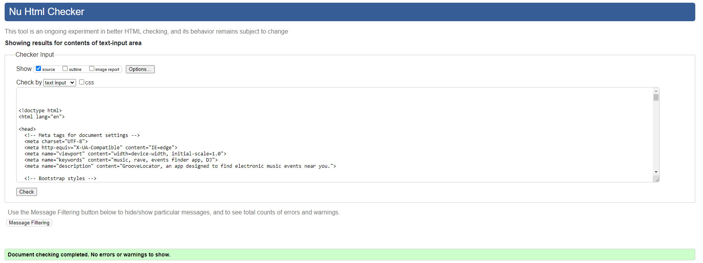

# Testing

## Code validation

### HTML

I used [HTML W3C Validator](https://validator.w3.org) to validate all of my HTML files.

Because my project uses Jinja syntax, I copied source data from each page and validated by input.

| Page | Screenshot | Notes |
| --- | --- | --- |
|Home Logged Out  | |Pass |
|Home Logged In  | |Pass |
|Login | |Pass |
|Sign up|  |Fail(However this HTML code is part of the Django authentication form, and I could find no way to change it.) |
|Logout  | |Pass |
|Events Logged Out  | |Pass |
|Events Logged In  | |Pass |
|Saved Events | |Pass |
|Event Details Logged Out | |Pass |
|Event Details Logged In | |Pass |

### CSS

My CSS passed via direct input using the [CSS Jigsaw Validator](https://jigsaw.w3.org/css-validator). However it is important to note that when validating by URI, I receive errors relating to bootstrap CSS. I discussed this with my mentor and he assured me that this is not a problem. 

    

        
### Javascript

My current implementation combines JavaScript with Jinja and Django template language, which complicates the validation process. To enhance the structure for future iterations, I intend to separate my JavaScript code into dedicated files. Additionally, I plan to securely pass the Google Maps API key through a Django view.

Despite this, thorough inspection using Google Dev Tools in the browser console reveals no errors related to my JavaScript code.

### Python

I have used the [CI Python Linter](https://pep8ci.herokuapp.com) to validate my Python files.

| File | Screenshot | Notes |
| --- | --- | --- |
| settings.py |  | Pass|
| models.py |  | Pass |
| urls.py (GrooveLocator) |  | Pass |
| urls.py (Map) |  | Pass |
| views.py (Map) |  | Pass |
| forms.py |  | Pass |

## Lighthouse

| Page | Device | Screenshot|
| --- | --- | --- |
| Home (Logged In) | Desktop |   |
| Home (Logged In) | Mobile |   |
| Home (Logged Out) | Desktop |   |
| Home (Logged Out) | Mobile |   |
| Events List | Desktop |   |
| Events List | Mobile |   |
| Event details (Logged In) | Desktop |   |
| Event details (Logged In) | Mobile |   |
| Event details (Logged Out) | Desktop |   |
| Event details (Logged Out) | Mobile |   |
| Login | Desktop |   |
| Login | Mobile |   |
| Logout | Desktop |   |
| Logout | Mobile |   |
| Sign Up| Desktop |   |
| Sign Up| Mobile |   |

## Manual testing 

| Page | User Action | Expected Result | Pass/Fail |
| --- | --- | --- | --- |
| Home | Verify the page loads | The Home page is displayed with the map and filter form | Pass |
| Home | Click on "Get My Location" button | Map zooms to user's geolocation | Pass |
| Home | Click on the "Choose a Genre" dropdown | A dropdown of available genres can be seen | Pass |
| Home | Click on the filter button after choosing a genre | The map repopulates only with events that match the selected genre | Pass |
| Home | Click on the "Toggle Legend" button | The legend opens displaying icons and associated genres | Pass |
| Home | Click on the "Toggle Legend" button | The legend collapses when the button is clicked again | Pass |
| Home | Click on an event icon on the map | The infowindow for the event opens with relevant information | Pass |
| Home | Click on "Event Details" within an open infowindow | The user is redirected to the event details for that event | Pass |
| Home | Click on email link in the footer | Opens the user's email app | Pass |
| Home | Click on the social media icons in the footer | Opens the relevant social media page | Pass |
| Home | Verify the welcome message | A welcome message is displayed for authenticated users | Pass |
| Home | Verify the main heading | The main heading "Groove Locator" is displayed for non-authenticated users | Pass |
| Home | Verify the about section text | The about section text is displayed for non-authenticated users | Pass |
| Home | Click on "Join The Groove" button in the center | The user is redirected to the sign-up page | Pass |
| Home | Verify the display of user testimonials | User testimonials are displayed with images and reviews | Pass |
| Home | Verify the correct initialization of the Google Map | The map is initialized and displayed correctly | Pass |
| Home | Verify the correct display of custom markers on the map | Custom markers are displayed based on event genre | Pass |
| Home | Verify the display of the legend icons and associated genres | The legend displays icons and genres correctly | Pass |
| Home | Verify the correct display of events based on the selected genre | Only events matching the selected genre are displayed on the map | Pass |
| Sign Up | Verify the page loads | The Sign Up page is displayed with the sign-up form | Pass |
| Sign Up | Submit the form with valid information | User account is created, and the user is redirected to the home page | Pass |
| Sign Up | Submit the form with invalid information | Appropriate error messages are displayed, and the user is not redirected | Pass |
| Sign Up | Verify the presence of form fields | The sign-up form contains required fields such as username, email, and password | Pass |
| Sign Up | Verify the presence of the "Sign Up" button | The "Sign Up" button is present on the form | Pass |
| Sign Up | Click on the "Sign In" link | The user is redirected to the login page | Pass |
| Sign Up | Attempt to sign up with an existing username | Appropriate error message is displayed, and the user is not redirected | Pass |
| Sign Up | Verify the redirection after successful sign-up | The user is redirected to the home page | Pass |
| Sign Up | Verify the redirection after unsuccessful sign-up | The user stays on the sign-up page with appropriate error messages | Pass |
| Sign Up | Verify the correctness of error messages | Error messages clearly indicate the issues with the provided information | Pass |
| Sign Up | Test the responsiveness of the page | The Sign Up page displays correctly on different screen sizes | Pass |
| Login  | Verify the page loads | The Login page is displayed with the login form       | Pass |
| Login  | Submit the form with valid credentials | User is authenticated and redirected to the home page | Pass |
| Login  | Submit the form with invalid credentials | Appropriate error messages are displayed, and the user is not redirected | Pass |
| Login  | Verify the presence of form fields | The login form contains required fields such as email/username and password | Pass |
| Login  | Verify the presence of the "Sign In" button | The "Sign In" button is present on the form | Pass |
| Login  | Click on the "Sign Up" link | The user is redirected to the sign-up page | Pass |
| Login  | Verify the redirection after successful login | The user is redirected to the home page | Pass |
| Login  | Verify the redirection after unsuccessful login | The user stays on the login page with appropriate error messages | Pass |
| Login  | Verify the correctness of error messages | Error messages clearly indicate issues with the provided credentials | Pass |
| Login  | Test the responsiveness of the page | The Login page displays correctly on different screen sizes | Pass |
| Logout | Verify the page loads   | The Logout page is displayed with the sign-out form | Pass | 
| Logout | Click on the "Sign Out" button | The user is logged out and redirected to the home page | Pass |
| Logout | Verify the redirection after sign-out | The user is redirected to the home page or the intended destination | Pass |
| Logout | Test the responsiveness of the page | The Logout page displays correctly on different screen sizes | Pass |
| Logout | Attempt to access authenticated pages after sign-out | The user is redirected to the login page | Pass |
| Logout | Attempt to access the logout pages after sign-out | The user is redirected to the home page | Pass |
| Logout | Verify the presence of the "Sign Out" button | The "Sign Out" button is present on the form | Pass |
| Logout | Verify the CSRF token is present | The form contains a CSRF token for security | Pass |
| Logout | Test the behavior when the user clicks another page | The user is directed to the relevant page and does not sign out| Pass |
| Logout | Verify the correctness of confirmation message | The confirmation message prompts the user to confirm the sign-out | Pass |
| Events List | Verify the page loads | The Events List page is displayed with the list of events | Pass |
| Events List | Verify the presence of the filter form | The filter form with options for genre, city, and date is visible | Pass |
| Events List | Choose a genre from the dropdown and click Filter | The events are filtered based on the selected genre | Pass |
| Events List | Enter a city in the input field and click Filter | The events are filtered based on the entered city | Pass |
| Events List | Select a date from the date picker and click Filter | The events are filtered based on the selected date | Pass |
| Events List | Choose a genre, enter a city, select a date, and click Filter | The events are filtered based on all selected criteria | Pass |
| Events List | Click on an event image | Redirects to the Event Details page for the selected event | Pass |
| Events List | Click on the event title | Redirects to the Event Details page for the selected event | Pass |
| Events List | Verify the correct display of event details | Event details, including title, date, and location, are displayed correctly | Pass |
| Events List | Click on the pagination links | Navigates to the next or previous page of events if available | Pass |
| Events List | Verify the correct display of pagination | Pagination links are shown if there are multiple pages of events | Pass |
| Event Details | Verify the page loads | The Event Details page is displayed with event information | Pass |
| Event Details | Verify correct display of event image | The event image is displayed correctly | Pass |
| Event Details | Verify correct display of event title | The event title is displayed correctly | Pass |
| Event Details | Verify correct display of event details | The event details are displayed correctly | Pass |
| Event Details | Verify the "Save Event" button (when authenticated) | The button displays either a filled or empty heart icon based on the save status | Pass |
| Event Details | Click the "Save Event" button | The event is saved or unsaved based on the current save status | Pass |
| Event Details | Verify the correct display of additional event information | The number of users interested, event date, time, and ticket price are displayed correctly | Pass |
| Event Details | Verify the "Add Your Event Details" section (when authenticated and event is saved) | The section displays a button to toggle a form for adding event details | Pass |
| Event Details | Click on the "Add Your Event Details" button | The form for adding event details is displayed | Pass |
| Event Details | Fill and submit the event details form | The details are saved, and the form collapses | Pass |
 Saved Events | View the page | The "Your Saved Events" page is displayed | Pass |
| Saved Events | Check for the presence of saved events | Saved events are displayed on the page | Pass |
| Saved Events | Click on a saved event | Redirects to the details page of the selected event | Pass |
| Saved Events | Check the display of event details | Event details, including title, date, and location, are displayed | Pass |
| Saved Events | Click on pagination links | Navigates to other pages if available | Pass |
| Saved Events | Verify the presence of the "Next" button | The "Next" button is present for pagination | Pass |
| Saved Events | Verify the presence of the "Previous" button | The "Previous" button is present for pagination | Pass |
| Saved Events | Test responsiveness of the page | The page displays correctly on different screen sizes | Pass |
| Saved Events | Check behavior with no saved events | Displays a message indicating no saved events | Pass |
| Saved Events | Test the layout with various saved events | The layout accommodates varying numbers of saved events | Pass |
| Saved Events | Test the layout with different screen sizes | The layout is responsive and adjusts to different screen sizes | Pass |

## User Story testing

| User Story | Pass/Fail |
| --- | --- |
| As a user, I can view event details so that I can learn more about the event. | Pass |
| As a registered user, I can save events so that I can keep track of which events I want to attend. | Pass |
| As a user, I can see events on a map, with different symbols for genre so that I can quickly identify events I would like to attend. | Pass |
| As a new user, I can create an account so that I can access and save events. | Pass |
| As a user with accessibility needs, I can easily access and use the website using a screen reader so that I can use and enjoy the site. | Pass |
| As a site admin, I can create events so that I can efficiently manage and coordinate events. | Pass |
| As a developer, I can link to the google maps api so that I can display event data visually. | Pass |
| As a user, I can add details of my hotels/ travel to my saved events so that I can be organized and choose which events I would like to attend. | Pass |
| As a user, I can also save an event using the map so that I can easily find and save events I would like to go to. | Fail (Listed as Won't have) |
| As a user, I can only access the saved events if I am logged in so that I can have a good user experience.| Pass |
| As a user, I can view and use the web app on all screen sizes so that I can change my device and access the app. | Pass |
| As a user, I can see a legend for the map so that I can know what each symbol means in relation to genre. | Pass |
| As a user, I can see alert boxes after certain actions so that I can clearly understand and confirm the consequences of my actions.. | Pass |
| As a user, I can browse events across multiple pages so that I can manage and navigate through a reasonable quantity of events at a time. | Pass |
| As a user, I can filter events by date, city and genre so that I can view events relevant to my location and preferences. | Pass |
|As a user, I can pick a specific date or date range so that I can see when I can go to different events and not have too much information on the map. | Partial pass (A specific date can be picked, but past dates can also be picked and no range can be selected) |

## Bugs

The list of bugs can be found in my Git Hub project board.

### Fixed Bugs

| Bug | Resolution |
| --- | --- |
| My CSS was not displaying when deployed on Heroku, with the error "Incorrect MIME type" | Changed DEBUG to False |
| The add event details expandable was stretching content when opened | Moved the button below other content to prevent this from occurring |
| Footer not sticking to the bottom of the page when there was not enough content to push it down  | Followed a Youtube tutorial and edited my css to ensure footer was always at the bottom  |
| The content within the sign up box was overflowing at smaller screen sizes | The max width was too narrow so content was spilling out vertically |
| Content did not fit within the google maps infowindows | I set minimum height to auto, prevented overflow from showing (as this was creating a scroll bar) and added padding to the elements inside. I also set up media queries so that content fit across screen sizes|
| The close button for the infowindow was too small and multiple infowindows could be opened at a time | I used dev tools to locate what code I had to change to increase the size, change the position and colour. I found code on the google developer website that allowed only one window to be open at a time |
| Add event details button was not centralized on the screen on mobile devices | Added the bootstrap class lg to the column which resolved the issue |

### Remaining Bugs

| Bug |
| --- |
| The events on the saved events page are not listed in date order  |
| The alerts do not auto-dismiss because they were giving me a console error so this functionality was removed |
| The input fields for login/ signup are too wide. This is so their associated headings are centralized. But I aim to fix this in the future |

